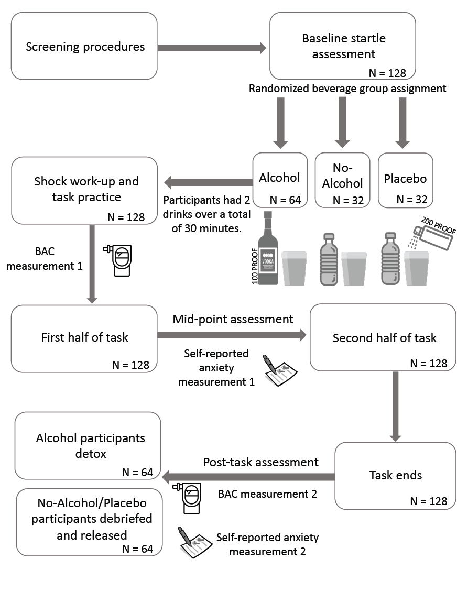
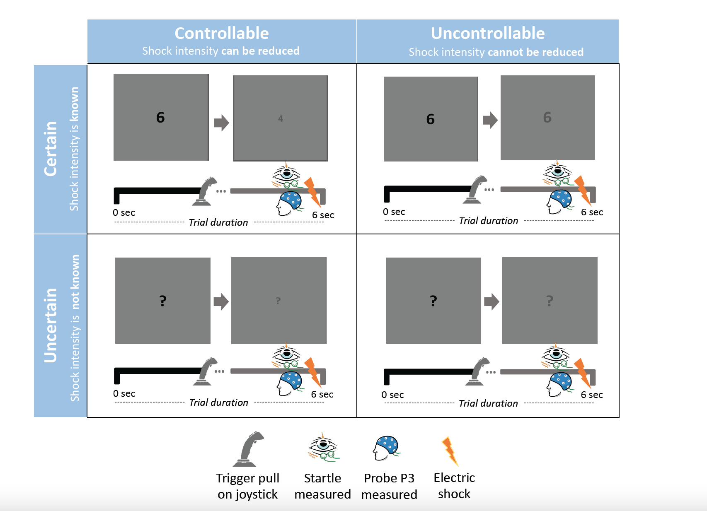

```{r setup, include=FALSE}
knitr::opts_chunk$set(echo = FALSE)
```
The following figures are featured in [Bradford et al., 2022](https://beaverslab.com/files/Publications/BradfordD2021a.pdf).


```{r out.width='350px', out.extra='style="float:center; padding:10px"', echo=FALSE}

```


```{r out.width='350px', out.extra='style="float:center; padding:10px"', echo=FALSE}

```

---

Distill is a publication format for scientific and technical writing, native to the web. 

Learn more about using Distill for R Markdown at <https://rstudio.github.io/distill>.


