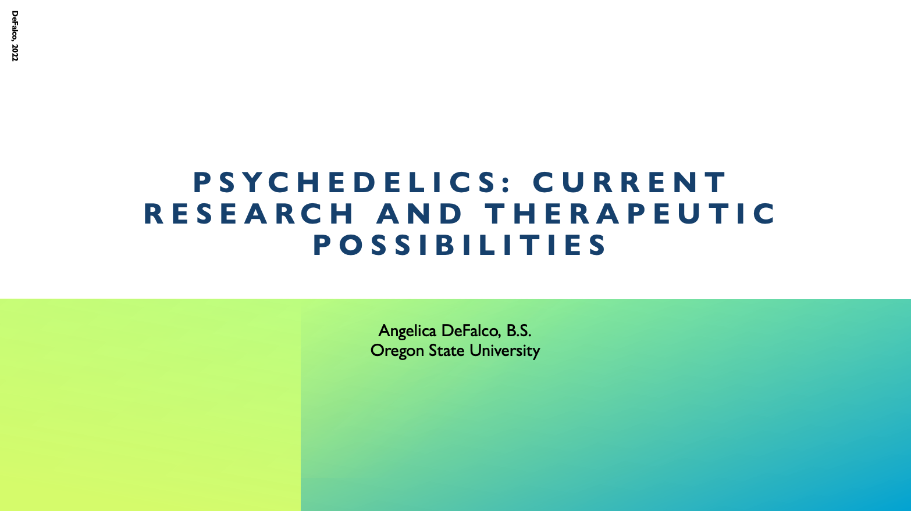

```{r setup, include=FALSE}
knitr::opts_chunk$set(echo = FALSE)
```

**Psychedelics: Current Research and Therapeutic Possibilities**
```{r out.width='600px', out.extra='style="float:center; padding:10px"', echo=FALSE}

```
[PDF](files/Psychedelics_Lecture_Final.pdf)

---
Distill is a publication format for scientific and technical writing, native to the web. 

Learn more about using Distill for R Markdown at <https://rstudio.github.io/distill>.


