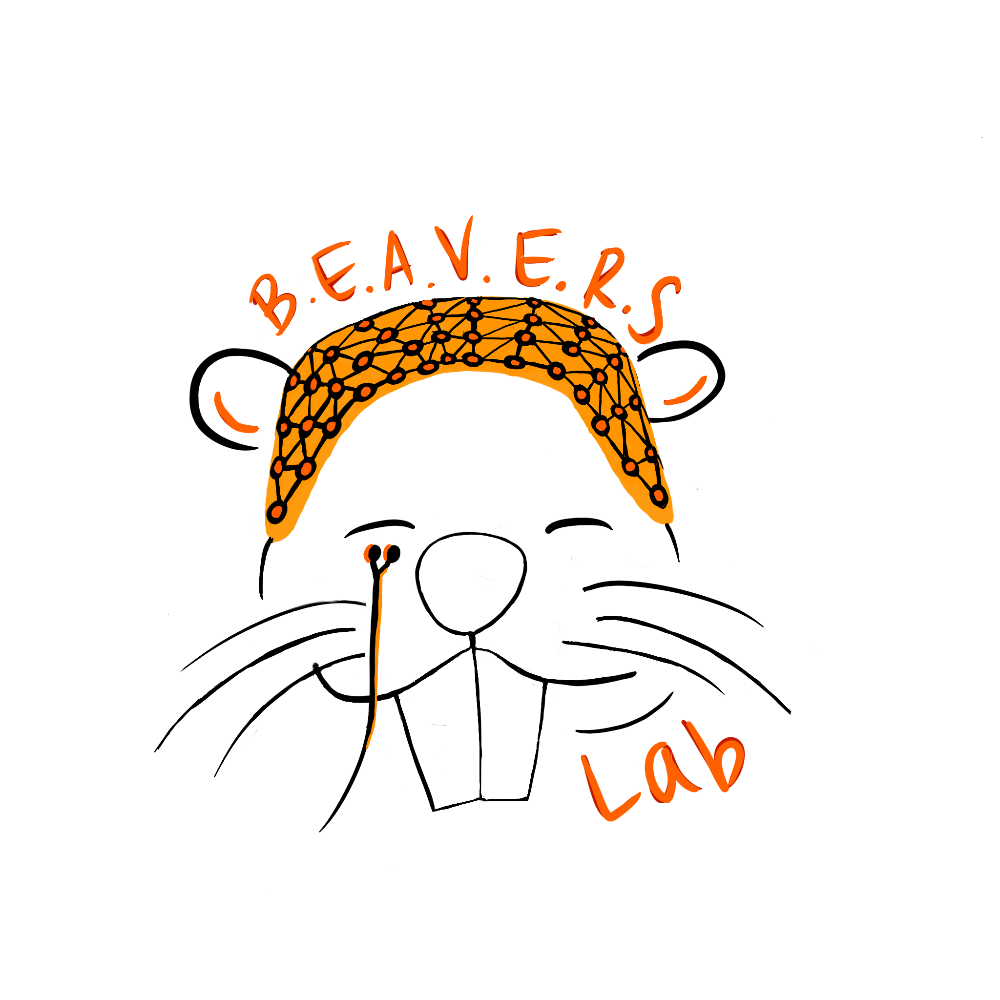

```{r setup, include=FALSE}
knitr::opts_chunk$set(echo = TRUE)
```

*BEAVERS-Lab Logo*
```{r out.width='200px', out.extra='style="float:center; padding:10px"', echo=FALSE}

```

*BRAD-Lab Logo*
```{r out.width='200px', out.extra='style="float:center; padding:10px"', echo=FALSE}

```
---
Distill is a publication format for scientific and technical writing, native to the web. 

Learn more about using Distill for R Markdown at <https://rstudio.github.io/distill>.


