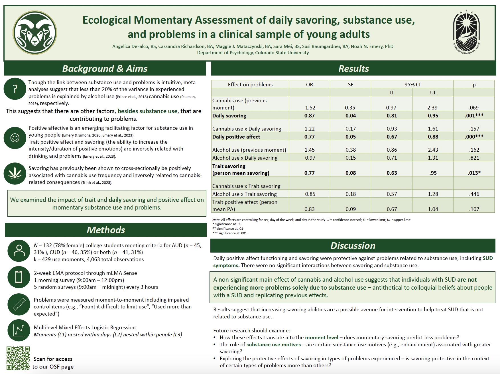
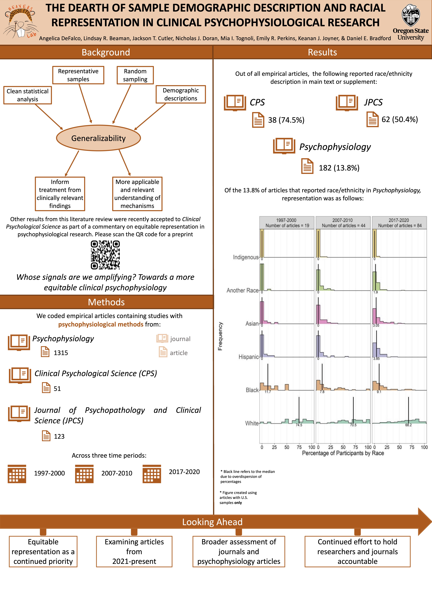
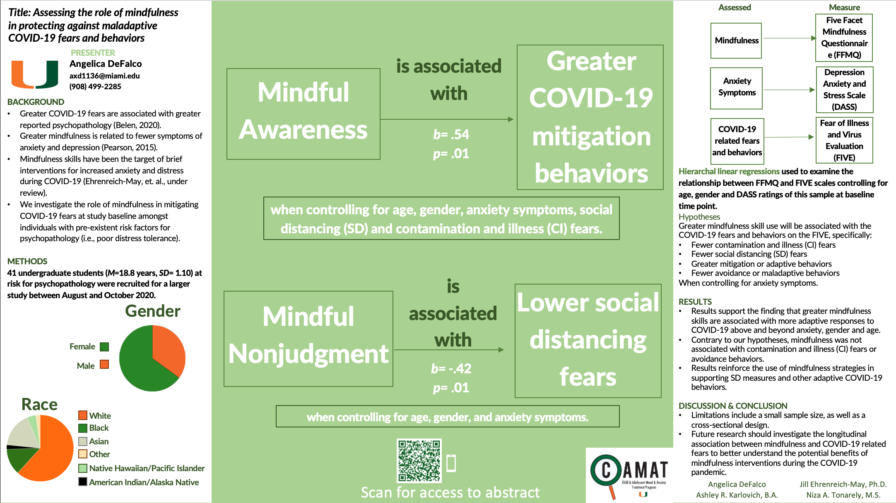

```{r setup, include=FALSE}
knitr::opts_chunk$set(echo = FALSE)
```

```{r out.width='600px', out.extra='style="float:center; padding:10px"', echo=FALSE}

```
[PDF](files/Posters/CPA_2024_SAVORING.pdf)

```{r out.width='600px', out.extra='style="float:center; padding:10px"', echo=FALSE}
knitr::include_graphics("files/Posters/Concussion_Poster_2022_FINAL.jpg")
```
[PDF](files/Posters/Concussion_ Poster_2022_FINAL.pdf)

```{r out.width='600px', out.extra='style="float:center; padding:10px"', echo=FALSE}

```
[PDF](files/Posters/SPR_Poster_FINAL.pdf)

```{r out.width='600px', out.extra='style="float:center; padding:10px"', echo=FALSE}

```
[PDF](files/Posters/PSY 491 poster.pdf)

```{r out.width='600px', out.extra='style="float:center; padding:10px"', echo=FALSE}
knitr::include_graphics("files/Posters/RCIF Poster.png")
```
[PDF](files/Posters/DeFalco_RCIF Poster 2021.pdf)

```{r out.width='600px', out.extra='style="float:center; padding:10px"', echo=FALSE}

```
[PDF](files/Posters/ADAA Poster.pdf)

---

Distill is a publication format for scientific and technical writing, native to the web. 

Learn more about using Distill for R Markdown at <https://rstudio.github.io/distill>.


